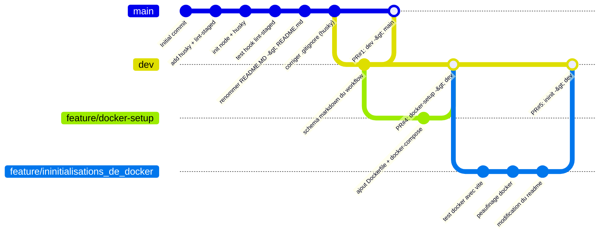

```mermaid
gitGraph
   commit id: "Initial commit"
   commit id: "add husky + lint-staged"
   commit id: "init node + husky"
   commit id: "test hook lint-staged"
   commit id: "renommer README.MD -> README.md"
   commit id: "corriger .gitignore (husky)"
   branch dev
   checkout dev
   commit id: "schema markdown du workflow"
   checkout main
   merge dev id: "PR#1: dev -> main"
   checkout dev
   branch feature/docker-setup
   checkout feature/docker-setup
   commit id: "ajout Dockerfile + docker-compose"
   checkout dev
   merge feature/docker-setup id: "PR#4: docker-setup -> dev"
   branch feature/ininitialisations_de_docker
   checkout feature/ininitialisations_de_docker
   commit id: "test docker avec vite"
   commit id: "peaufinage docker"
   commit id: "modification du readme"
   checkout dev
   merge feature/ininitialisations_de_docker id: "PR#5: ininit -> dev"
```
